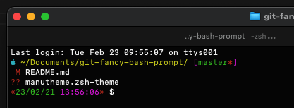

# Fancy Bash Prompt for Git local repositories

## How to install it

* If you are on the current git repo folder in your machine, copy the `.git-functions.sh` file on `/home/$YOUR-USER` using the file system GUI or using the terminal with:
    ```
    $ cp .git-functions.sh ~/.git-functions.sh
    ```

* Now we have to make a backup of your original `~/.bashrc` file, you can make it with:
    ```
    $ cp ~/.bashrc ~/.bashrc.backup
    ```

* Open the file `~/.bashrc` with you desired text editor and replace the existing lines with these next:
    ```
    ...
    # Adding the git functions
    . ~/.git-functions.sh

    if [ "$color_prompt" = yes ]; then
        GITBASH='$(prompt-timing-right)$(git-status-upstream)$(git-multiline-status-prompt)'
        PS1='${debian_chroot:+($debian_chroot)}\[\033[01;35m\]\u:\[\033[01;34m\]\w\[\033[00m\]\'
        PS1=${PS1%?}
        PS1=${PS1%?}\n"\[\033[01;31m\][\[\033[01;33m\]\A \[\033[01;32m\]\D{%F}\[\033[01;37m\]\[\033[01;31m\]]"'\[\033[01;37m\]'
        PS1=${GITBASH}\\n${PS1}'$\[\033[00m\] '
    else
        PS1='${debian_chroot:+($debian_chroot)}\u@\h:\w\$ '
    fi
    ...
    ```
* In order to have updated all the repos that we have in our local machine we need to create a job in `cron` program, for that we need to open that program with the next steps

    * If is the first time you run `cron` you will be prompted as follows:
        ```
        $ crontab -e
        no crontab for $YOUR-USER - using an empty one

        Select an editor.  To change later, run 'select-editor'.
        1. /bin/ed
        2. /bin/nano        <---- easiest
        3. /usr/bin/code
        4. /usr/bin/vim.tiny

        Choose 1-4 [2]: 2
        ```
    * Once we selected our prefered CLI text editor we must append this next line:
        ```
        */1 *   *   *   *     manuelperez; /usr/bin/find ~ -name ".git" -execdir /usr/bin/git fetch > /home/manuelperez/.log-git-fetcher.log \;
        ```
        That above line will make `git fetch` in all the local repos we have every minute in order to know if we are **behind** or **ahead** from **remote**.

        To store your Github credentials please run the next command:
        ```
        $ git config --global credential.helper store
        ```

* Now you will be able to see the fancy bash prompt for local git repositories.

## Oh my Zsh
* I started to use a hackintosh PC, so I tried to use this repo to customize the Terminal with no luck, but I found the [Oh My Zsh](https://github.com/ohmyzsh/ohmyzsh) project, a framework to configurate and customize the `zsh` Terminal in MacOS.
* I tried to build a new zsh theme based in the already installed theme called `apple`, you can find it [here](manutheme.zsh-theme).
* To "install" it, please go to ` ~/.oh-my-zsh/themes/` folder and capy my theme in that folder, after that we can start use it editing `~/.zshrc` with your preferred text editor and do this next:
    * ````
      ...

      # Set name of the theme to load --- if set to "random", it will
      # load a random theme each time oh-my-zsh is loaded, in which case,
      # to know which specific one was loaded, run: echo $RANDOM_THEME
      # See https://github.com/ohmyzsh/ohmyzsh/wiki/Themes
      ZSH_THEME="manutheme"
      
      ...
      ````
* The result will be like:

    

* Need to fix an issue. When I tried to do autocomplete with tab key I got this next:

    

* The issue was solved and also added the username. The results are:

    